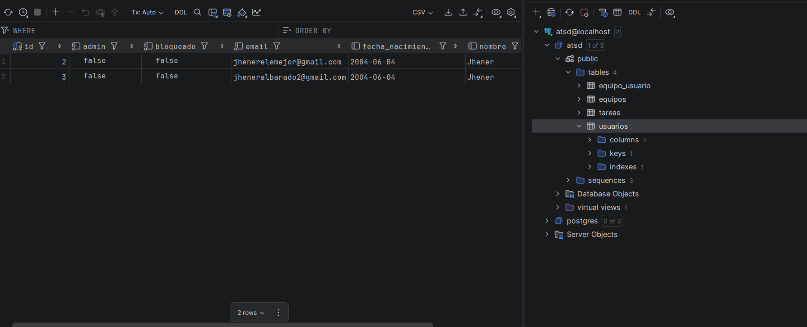

# 📝 To-Do List & Team Management App - Release 1.2.0


Esta aplicación de gestión de tareas y equipos ha sido desarrollada para la Práctica 3 (ATSD - E3), integrando PostgreSQL y siguiendo rígidamente la metodología **Test-Driven Development (TDD)** y un flujo de trabajo basado en ramas e *issues*.

---

## 🚀 Guía de Configuración y Ejecución (PostgreSQL)

La aplicación ha sido migrada para funcionar con **PostgreSQL**. Se han otorgado permisos al wrapper `./mvnw` para facilitar su ejecución.

### 1. Entorno de Desarrollo Local
Inicia el contenedor de base de datos para desarrollo:
```bash
docker run -d -p 5432:5432 --name postgres-develop -e POSTGRES_USER=atsd -e POSTGRES_PASSWORD=atsd -e POSTGRES_DB=atsd postgres:13
```
Inicia la aplicación (usando el perfil de Postgres):
```bash
./mvnw spring-boot:run "-Dspring-boot.run.profiles=postgres"
```
> 💡 **Nota (Data Seeder):** Al arrancar la aplicación, un `CommandLineRunner` (DataSeeder) generará automáticamente 3 equipos de prueba (*Equipo Alfa, Equipo Beta, Equipo Gamma*) para facilitar la revisión del listado de equipos.

### 2. Entorno de Pruebas (Tests de Integración)
Para ejecutar los tests automatizados y evitar conflictos, se utiliza una base de datos independiente:
```bash
docker run -d -p 5432:5432 --name postgres-test -e POSTGRES_USER=atsd -e POSTGRES_PASSWORD=atsd -e POSTGRES_DB=atsd_test postgres:13
```
Lanzar los tests:
```bash
./mvnw test "-Dspring.profiles.active=postgres"
```

### 3. Base de datos (captura de pantalla).


---

## 📋 Gestión del Proyecto y Metodología (v1.2.0)

### Enlaces de Control
* 📋 **Tablero Trello Oficial:** Trello Board - To Do List App (E3) [[TRELLO](https://trello.com/invite/b/6a057e1780076a27ce1afea6/ATTI2cfbb93a894b4466505436cabb8c28ce4482793F/e3-atsd-to-do-list-new-app)]
* 💻 **Repositorio GitHub:** [[GITHUB](https://github.com/claim17/ATSD-P3)]
* 🐳 **Docker Hub:** [[DOCKERHUB](https://hub.docker.com/repository/docker/jheneralbarado/todolist-app/general)]

----
### Creación y Reparto de Issues
En Github se han creado **6 issues** para gestionar las funcionalidades. Cada funcionalidad se ha fragmentado sistemáticamente en 2 issues para alternar el desarrollo entre capas:
1. **Primera Parte:** Desarrollo de `Service` y `Model` (Orientado al backend y regido por TDD).
2. **Segunda Parte:** Desarrollo de `Views` y `Controllers`.

### Ciclo Test-Driven Development (TDD)
El desarrollo de la capa *Service y Model* sigue estrictamente:
- 🔴 **Test:** Escribir la prueba primero (debe fallar).
- 🟢 **Code:** Escribir el código mínimo y necesario para que pase la prueba.
- 🔵 **Refactor:** Mejorar el código manteniendo las pruebas en verde.

> 📌 **Política de Commits:** Es obligatorio realizar un *commit* por cada fase Test-Código. Si se refactoriza, se hace en un *commit* adicional.
---
### Descargar imagen de docker.
```
    docker pull jheneralbarado/p3-todolist-app:1.2.0
```
---
## 🛠️ Novedades de la Release 1.2.0

Esta versión introduce el sistema integral de Equipos con sus correspondientes gestiones,incorporacion de base de datos.

----
### 1. Service y Model - Lista de Equipos (Desarrollado por Jhener)
Implementación de la lógica de negocio mediante TDD de la entidad `Equipo` con relación `ManyToMany` bidireccional con `Usuario`.

*   **Nuevas Clases:** `EquipoData`, `Equipo`, `EquipoRepository`, `EquipoService`, `EquipoServiceException`.
*   **Tests Aislados:** `EquipoServiceTest` y `EquipoTest` implementados validando excepciones, creación y relaciones transaccionales.
*   **Métodos Clave:**
    *   `crearEquipo(String nombre)`
    *   `recuperarEquipo(Long id)`
    *   `findAllOrdenadosPorNombre()`
    *   `addUsuarioAEquipo(Long teamId, Long userId)` / `removeUsuario(Usuario)`

### 2. Vistas, Controladores y Enrutamiento (`EquipoController`)
*   `GET /equipos`: Listado de equipos de la empresa ordenados alfabéticamente.
*   `GET /equipos/{id}`: Detalles de un equipo y listado de sus usuarios miembros.
*   Tests unitarios (`EquipoControllerTest`) que validan accesos autorizados (carga de datos en `Model`) y accesos denegados (redirección `3xx` a `/login` si no hay sesión).

### 3. Gestión Integral de Membresía de Equipo
Permite a los usuarios pertenecer, crear y abandonar equipos dinámicamente.

*   **Nuevos Endpoints (`EquipoController`):**
    *   `GET /equipos/nuevo` y `POST /equipos/nuevo`: Formularios de creación (`formNuevoEquipo.html`). El creador se añade automáticamente.
    *   `GET /misequipos`: Muestra solo los equipos del usuario logueado (`misequipos.html`).
    *   `POST /equipos/{id}/unirse` y `POST /equipos/{id}/salir`: Lógica de membresía dinámica redirigiendo al detalle del equipo o listado global.
*   **Mejoras UI/UX:** Corrección de la barra de navegación en `formLogin.html` (oculta en el login), botones condicionales en `equipoDetalle.html` (Unirse/Salir según estado evaluado con `usuarioEnEquipo()`), y un acceso en el navbar hacia "Mis Equipos".
